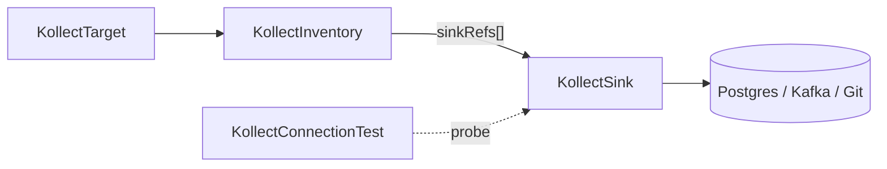

# KollectSink

**Scope:** Namespace · **Reconciled:** Connection probe only · **Short name:** —

## What it is for

A `KollectSink` describes **where** inventory exports go: Git, Postgres, Kafka, S3, GCS, or
GitLab (Phase 2). It holds endpoint URLs, credential `secretRef`s, TLS settings, and backend-specific
blocks (`postgres`, `kafka`). The inventory controller resolves `sinkRefs` and writes serialized
payloads; status stores summaries (commit SHA, row counts), not full payloads
([ADR-0006](../adr/0006-etcd-limit.md)).

Sinks are classified by **role**, not vendor ([ADR-0034](../adr/0034-sink-taxonomy-state-vs-stream.md)):

| Role | `type` | Notes |
| --- | --- | --- |
| Snapshot store | `git`, `s3`/`gcs` (`format: parquet`), HTTP | deletes free; Parquet queryable via DuckDB, no DB server |
| Relational SoR | `postgres` | rich SQL; needs delete reconciliation |
| Event emitter | `nats` (lean default), `kafka` (enterprise opt-in; Redpanda via Kafka API) | doubles as multi-cluster fan-in |
| Enterprise Git | `gitlab` (Phase 2) | internal CA via `tls.caSecretRef` |

See [ADR-0034](../adr/0034-sink-taxonomy-state-vs-stream.md),
[ADR-0025](../adr/0025-sink-backends-database-kafka.md),
[ADR-0030](../adr/0030-connection-test.md), [ADR-0032](../adr/0032-platform-architecture-pivot.md).

## How it fits the pipeline



| Relationship | Rule |
| --- | --- |
| `KollectInventory` → Sink | `spec.sinkRefs[]` lists sink **names** in the same namespace |
| `KollectScope` → Sink | When scope exists, every `sinkRef` must appear in `scope.sinkRefs` |
| `KollectConnectionTest` → Sink | `spec.sinkRef` names sink to probe |

Export debouncing and payload flow: [DATA-FLOWS.md](../DATA-FLOWS.md#1-export-debouncing).

## Spec fields

| Field | Type | Required | Description |
| --- | --- | --- | --- |
| `spec.type` | enum | Yes | `git`, `postgres`, `kafka` (shipped); `s3`/`gcs` (Parquet mode planned); `nats`, `gitlab` (planned) |
| `spec.endpoint` | string | No | Backend-specific destination URL or bucket |
| `spec.secretRef` | object | No | Secret with credentials (`name`, optional `namespace`) |
| `spec.tls` | object | No | `insecureSkipVerify`, `caSecretRef`, `caBundle` (max 64 KiB) |
| `spec.connectionTest` | bool | No | Probe on create/update when true |
| `spec.cluster` | string | No | Cluster label for multi-cluster exports |
| `spec.postgres` | object | No | `databaseRef`, `table`, `schema` |
| `spec.kafka` | object | No | `brokers[]`, `topic`, optional `secretRef` |
| `spec.gitlab` | object | No | GitLab-only: `mergeRequest` block when `type: gitlab` |
| `spec.gitlab.mergeRequest.mode` | enum | No | `direct` (default) or `merge_request` |
| `spec.gitlab.mergeRequest.targetBranch` | string | Cond. | Required when `mode: merge_request` — branch cloned as export base |
| `spec.gitlab.mergeRequest.branchPrefix` | string | No | Feature branch prefix (default `kollect`) |
| `spec.gitlab.mergeRequest.titleTemplate` | string | No | MR title; `{namespace}` and `{name}` placeholders |
| `spec.gitlab.mergeRequest.autoMerge` | bool | No | Reserved — MR auto-merge not wired |

### GitLab merge request mode

When `spec.type: gitlab` and `spec.gitlab.mergeRequest.mode: merge_request`:

1. Export clones `targetBranch` (or endpoint `#branch=` default).
2. Commits inventory JSON on feature branch `{branchPrefix}/{inventoryNamespace}/{inventoryName}`.
3. Pushes the feature branch via HTTPS git.
4. Opens or updates a merge request via GitLab API v4 when `secretRef` provides a token.

**Secret keys:** `token` or `password` for git push **and** REST API. Token scopes: `write_repository`
and `api` (project access token or personal access token with equivalent scopes).

Direct mode (`merge_request` unset or `mode: direct`) pushes to the endpoint default branch only.

## Sample usage

**Git** (small installs, audit trail):

```sh
kubectl apply -f config/samples/kollect_v1alpha1_kollectsink.yaml
kubectl wait --for=condition=ConnectionVerified kollectsink/git-inventory-demo \
  -n default --timeout=120s
kubectl describe kollectsink git-inventory-demo -n default
```

**Postgres** (portal / MVP path):

```sh
# Create DSN secret separately — never commit real credentials
kubectl apply -f config/samples/kollect_v1alpha1_kollectsink_postgres.yaml
kubectl get kollectsink postgres-inventory-demo -n default -o yaml
```

**Kafka**:

```sh
kubectl apply -f config/samples/kollect_v1alpha1_kollectsink_kafka.yaml
```

Wire inventory to a sink:

```sh
kubectl apply -f config/samples/kollect_v1alpha1_kollectinventory.yaml
kubectl get kinv -n default team-inventory -o jsonpath='{.status.conditions}'
```

Re-probe without editing spec:

```sh
kubectl annotate kollectsink git-inventory-demo -n default \
  kollect.dev/test-connection=true --overwrite
```

## Status conditions

| Type | When set | Meaning | Remediation |
| --- | --- | --- | --- |
| `ConnectionVerified=True` | Probe succeeds | Endpoint reachable | None — inventory may export |
| `ConnectionVerified=False` | Probe fails | `reason`: `ConnectionTestFailed`, `SecretResolveFailed`, … | Fix Secret keys, network, TLS; see message |
| `Degraded=True` | Probe failed | Mirrors connection failure | Same as above |
| `TLSInsecure=True` | `insecureSkipVerify` | Warning — TLS verification disabled | Set `caSecretRef` or proper CA in production |

Inventory and targets also surface `SinkReachable` when linked sinks fail verification.

## RBAC

| Actor | Verbs | Resource | Notes |
| --- | --- | --- | --- |
| Sink admins | `create`, `update`, `patch`, `delete` | `kollectsinks` | Team namespace |
| Developers | `get`, `list`, `watch` | `kollectsinks` | Read export destinations |
| Operator | `get`, `list`, `watch` | `kollectsinks` | Inventory export + connection probe |
| Operator | `get`, `list`, `watch` | `secrets` | Resolve `secretRef` / `databaseRef` only |

Restrict Secret access to operator ServiceAccount; never put credentials in CR spec fields.

## Common failure modes

| Symptom | Reason | Fix |
| --- | --- | --- |
| `ConnectionVerified=False` `SecretResolveFailed` | Missing Secret or wrong namespace | Create Secret in referenced namespace; check `secretRef.name` |
| `ConnectionVerified=False` `ConnectionTestFailed` | Bad DSN, broker down, Git auth | Verify endpoint from a debug pod; test with [KollectConnectionTest](kollectconnectiontest.md) |
| Inventory `ScopeSinkDenied` | Sink not in scope allow-list | Add sink name to `KollectScope.spec.sinkRefs` |
| Inventory `SinkNotFound` | Typo in `sinkRefs` | Match exact `metadata.name` in same namespace |
| Inventory `SinkUnreachable` | Prior probe failed | Fix sink; re-annotate `kollect.dev/test-connection=true` |
| `TLSInsecure` warning | `insecureSkipVerify: true` | Mount CA via `tls.caSecretRef` (GitLab Phase 2) |
| Postgres upsert errors | Schema/table mismatch | Align `postgres.table` / `schema` with DB migration |
| No Git commits | Missing `secretRef` for private repo | Create push credentials Secret; set `spec.secretRef` |

## See also

- [KollectInventory](kollectinventory.md) — references sinks for export
- [KollectConnectionTest](kollectconnectiontest.md) — audited probes
- [DATA-FLOWS.md](../DATA-FLOWS.md)
- [examples/deployment-inventory.md](../examples/deployment-inventory.md)
