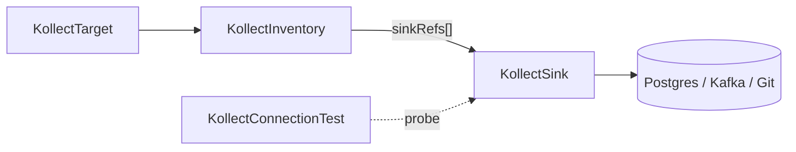

# KollectSink

**Scope:** Namespace · **Reconciled:** Connection probe only · **Short name:** —

!!! warning "Same-namespace references"
    `KollectInventory.spec.sinkRefs` and `KollectConnectionTest.spec.sinkRef` must name sinks in the
    **same namespace** as the referring CR. Cluster inventory resolves sinks in `spec.sinkNamespace`.

## What it is for

A `KollectSink` describes **where** inventory exports go. The sink registry ships seven `spec.type`
values; inventory and cluster-inventory controllers resolve `sinkRefs` and write serialized payloads.
Status stores summaries (commit SHA, row counts), not full payloads
([ADR-0103](../adr/0103-etcd-limit.md)).

Sinks are classified by **role**, not vendor ([ADR-0401](../adr/0401-sink-taxonomy-state-vs-stream.md)):

| Role | `spec.type` | Shipped | Notes |
| --- | --- | --- | --- |
| Snapshot store | `git` | ✅ | JSON commits; audit trail |
| Enterprise Git | `gitlab` | ✅ | Same snapshot role as `git`; internal CA via `tls.caSecretRef`; optional MR mode |
| Snapshot store | `s3`, `gcs` | ✅ | JSON object export today; Parquet snapshot mode planned ([ADR-0401](../adr/0401-sink-taxonomy-state-vs-stream.md)) |
| Relational SoR | `postgres` | ✅ | Upsert + delete reconciliation for stale rows |
| Event emitter | `nats` | ✅ | Lean default stream sink (JetStream) |
| Event emitter | `kafka` | ✅ | Enterprise opt-in; Redpanda via Kafka API |

See [ADR-0401](../adr/0401-sink-taxonomy-state-vs-stream.md),
[ADR-0402](../adr/0402-sink-backends-database-kafka.md),
[ADR-0403](../adr/0403-connection-test.md), [ADR-0703](../adr/0703-platform-architecture-pivot.md).

## How it fits the pipeline



| Relationship | Rule |
| --- | --- |
| `KollectInventory` → Sink | `spec.sinkRefs[]` lists sink **names** in the same namespace |
| `KollectScope` → Sink | When scope exists, every `sinkRef` must appear in `scope.sinkRefs` |
| `KollectConnectionTest` → Sink | `spec.sinkRef` names sink to probe |

Export debouncing and payload flow: [DATA-FLOWS.md](../DATA-FLOWS.md#1-export-debouncing).

## Spec fields

| Field | Type | Required | Description |
| --- | --- | --- | --- |
| `spec.type` | enum | Yes | See [type enum](#type-enum) — all seven registry values are shipped |
| `spec.endpoint` | string | No | Backend-specific destination URL or bucket |
| `spec.secretRef` | object | No | Secret with credentials (`name`, optional `namespace`) |
| `spec.tls` | object | No | `insecureSkipVerify`, `caSecretRef`, `caBundle` (max 64 KiB) |
| `spec.connectionTest` | bool | No | Probe on create/update (default **true**; set `false` to opt out) |
| `spec.cluster` | string | No | Cluster label for multi-cluster exports |
| `spec.pathTemplate` | string | No | Git/object-store object path layout ([ADR-0407](../adr/0407-git-object-store-layout.md)); default `inventory/{namespace}/{name}.json` |
| `spec.objectStore` | object | No | S3/GCS snapshot format (`json` or `parquet`) and Parquet hot columns |
| `spec.postgres` | object | No | `databaseRef`, `table`, `schema` |
| `spec.kafka` | object | No | `brokers[]`, `topic`, optional `secretRef` |
| `spec.git` | object | No | Git-only export knobs when `type: git` |
| `spec.git.branch` | string | No | Target branch (overrides `endpoint#branch=`; default `main`) |
| `spec.git.pushPolicy` | enum | No | `Commit` (default) or `ForcePush` (snapshot HEAD) |
| `spec.git.auth.type` | enum | No | `token` (HTTPS) or `ssh` |
| `spec.git.auth.secretRef` | object | No | Overrides top-level `secretRef` for git credentials |
| `spec.git.commitMessage` | string | No | Template with `{namespace}`, `{name}`, `{cluster}`, `{generation}` |
| `spec.git.author` | object | No | `name` / `email` committer override |
| `spec.git.cloneDepth` | int | No | Shallow clone depth (default `1`) |
| `spec.git.prune` | bool | No | Stage deletions before commit |
| `spec.gitlab` | object | No | GitLab-only: `mergeRequest` block when `type: gitlab` |
| `spec.gitlab.mergeRequest.mode` | enum | No | `direct` (default) or `merge_request` |
| `spec.gitlab.mergeRequest.targetBranch` | string | Cond. | Required when `mode: merge_request` — branch cloned as export base |
| `spec.gitlab.mergeRequest.branchPrefix` | string | No | Feature branch prefix (default `kollect`) |
| `spec.gitlab.mergeRequest.titleTemplate` | string | No | MR title; `{namespace}` and `{name}` placeholders |
| `spec.gitlab.mergeRequest.autoMerge` | bool | No | Reserved — MR auto-merge not wired |

### Type enum

All values below are registered in the sink factory ([ADR-0406](../adr/0406-sink-registry.md)) and
export inventory payloads when referenced by `KollectInventory` or `KollectClusterInventory`.

| `spec.type` | Role | Deletes | Connection probe |
| --- | --- | --- | --- |
| `git` | Snapshot store | Implicit (whole-file replace) | ✅ |
| `gitlab` | Snapshot store (enterprise Git) | Implicit | ✅ |
| `s3` | Snapshot store | Implicit | ✅ |
| `gcs` | Snapshot store | Implicit | ⬜ probe not wired ([ADR-0403](../adr/0403-connection-test.md)) |
| `postgres` | Relational SoR | Reconciled (`SupportsDelete`) | ✅ |
| `nats` | Event emitter | Consumer-owned | ⬜ probe not wired |
| `kafka` | Event emitter | Consumer-owned | ✅ |

### GitLab merge request mode

When `spec.type: gitlab` and `spec.gitlab.mergeRequest.mode: merge_request`:

1. Export clones `targetBranch` (or endpoint `#branch=` default).
2. Commits inventory JSON on feature branch `{branchPrefix}/{inventoryNamespace}/{inventoryName}`.
3. Pushes the feature branch via HTTPS git.
4. Opens or updates a merge request via GitLab API v4 when `secretRef` provides a token.

**Secret keys:** `token` or `password` for git push **and** REST API. Token scopes: `write_repository`
and `api` (project access token or personal access token with equivalent scopes).

Direct mode (`merge_request` unset or `mode: direct`) pushes to the endpoint default branch only.

### Git sink options

When `spec.type: git`, optional `spec.git` controls branch, push semantics, auth mode, and commit
identity ([ADR-0407](../adr/0407-git-object-store-layout.md)). Defaults: `pushPolicy: Commit`,
`cloneDepth: 1`, `commitMessage: kollect: export inventory`.

**Credentials:** top-level `spec.secretRef` or `spec.git.auth.secretRef`. HTTPS keys: `token`,
`password`, optional `username`. SSH keys: `ssh-privatekey`, `identity`, or `id_rsa`.

### Object path template

`spec.pathTemplate` controls where snapshot backends write each inventory export
([ADR-0407](../adr/0407-git-object-store-layout.md)). Applies to `git`, `gitlab`, `s3`, and `gcs`
when `spec.objectStore.format` is unset or `json`. Parquet mode uses a fixed Hive-style layout instead.

| Placeholder | Substituted with |
| --- | --- |
| `{cluster}` | `spec.cluster`, or `default` when empty |
| `{namespace}` | Inventory namespace |
| `{name}` | Inventory name |
| `{generation}` | Export generation counter |
| `{extension}` | File extension (default `.json`) |

**Default:** `inventory/{namespace}/{name}.json`

**Validation:** relative path only (no leading `/`, no `..` segments); must include `{namespace}` and
`{name}`; unsupported placeholders are rejected at admission.

Example multi-cluster layout:

```yaml
spec:
  type: s3
  cluster: prod-eu
  pathTemplate: "clusters/{cluster}/inventory/{namespace}/{name}{extension}"
```

### Export payload spill

Large exports are bounded per [ADR-0103](../adr/0103-etcd-limit.md) and
[REQUIREMENTS.md](../REQUIREMENTS.md#6-resolved-requirement-questions-2026-06-05):

| Threshold | Behavior |
| --- | --- |
| **≥ 1 MiB** | Operator logs a warn and increments `kollect_export_spill_warn_total` |
| **> 1 MiB** | **Mandatory object-store spill** — inventory must reference an `s3` or `gcs` sink in `sinkRefs` |
| **> `maxExportBytes`** (~1.5 MiB global default) | Export blocked — inventory `Degraded`, reason `PayloadTooLarge` |

When spill is mandatory, `git` / `gitlab` snapshot exports are **skipped** for that payload; `s3` /
`gcs` backends still receive the full JSON. If no object-store sink is configured, inventory surfaces
`Degraded=True`, reason `SpillRequired`. Pair a Git audit sink with S3/GCS for large inventories.

## Sample usage

**Git** (small installs, audit trail):

```sh
kubectl apply -f config/samples/kollect_v1alpha1_kollectsink.yaml
kubectl wait --for=condition=ConnectionVerified kollectsink/git-inventory-demo \
  -n default --timeout=120s
kubectl describe kollectsink git-inventory-demo -n default
```

**Postgres** (portal / MVP path):

```sh
# Create DSN secret separately — never commit real credentials
kubectl apply -f config/samples/kollect_v1alpha1_kollectsink_postgres.yaml
kubectl get kollectsink postgres-inventory-demo -n default -o yaml
```

**Kafka**:

```sh
kubectl apply -f config/samples/kollect_v1alpha1_kollectsink_kafka.yaml
```

Wire inventory to a sink:

```sh
kubectl apply -f config/samples/kollect_v1alpha1_kollectinventory.yaml
kubectl get kinv -n default team-inventory -o jsonpath='{.status.conditions}'
```

Re-probe without editing spec:

```sh
kubectl annotate kollectsink git-inventory-demo -n default \
  kollect.dev/test-connection=true --overwrite
```

## Status conditions

| Type | When set | Meaning | Remediation |
| --- | --- | --- | --- |
| `ConnectionVerified=True` | Probe succeeds | Endpoint reachable | None — inventory may export |
| `ConnectionVerified=False` | Probe fails | `reason`: `ConnectionTestFailed`, `SecretResolveFailed`, … | Fix Secret keys, network, TLS; see message |
| `Degraded=True` | Probe failed | Mirrors connection failure | Same as above |
| `TLSInsecure=True` | `insecureSkipVerify` | Warning — TLS verification disabled | Set `caSecretRef` or proper CA in production |

Inventory and targets also surface `SinkReachable` when linked sinks fail verification.

## RBAC

| Actor | Verbs | Resource | Notes |
| --- | --- | --- | --- |
| Sink admins | `create`, `update`, `patch`, `delete` | `kollectsinks` | Team namespace |
| Developers | `get`, `list`, `watch` | `kollectsinks` | Read export destinations |
| Operator | `get`, `list`, `watch` | `kollectsinks` | Inventory export + connection probe |
| Operator | `get`, `list`, `watch` | `secrets` | Resolve `secretRef` / `databaseRef` only |

Restrict Secret access to operator ServiceAccount; never put credentials in CR spec fields.

## Common failure modes

| Symptom | Reason | Fix |
| --- | --- | --- |
| `ConnectionVerified=False` `SecretResolveFailed` | Missing Secret or wrong namespace | Create Secret in referenced namespace; check `secretRef.name` |
| `ConnectionVerified=False` `ConnectionTestFailed` | Bad DSN, broker down, Git auth | Verify endpoint from a debug pod; test with [KollectConnectionTest](kollectconnectiontest.md) |
| Inventory `ScopeSinkDenied` | Sink not in scope allow-list | Add sink name to `KollectScope.spec.sinkRefs` |
| Inventory `SinkNotFound` | Typo in `sinkRefs` | Match exact `metadata.name` in same namespace |
| Inventory `SinkUnreachable` | Prior probe failed | Fix sink; re-annotate `kollect.dev/test-connection=true` |
| `TLSInsecure` warning | `insecureSkipVerify: true` | Mount CA via `tls.caSecretRef` (GitLab Phase 2) |
| Postgres upsert errors | Schema/table mismatch | Align `postgres.table` / `schema` with DB migration |
| No Git commits | Missing `secretRef` for private repo | Create push credentials Secret; set `spec.secretRef` |
| No Git commits (large inventory) | Payload > 1 MiB — Git skipped by spill policy | Add `s3` or `gcs` to inventory `sinkRefs`; verify object-store export |
| Inventory `SpillRequired` | Payload > 1 MiB without object-store sink | Add `s3`/`gcs` sink ref or trim attributes / split targets |

## See also

- [KollectInventory](kollectinventory.md) — references sinks for export
- [KollectConnectionTest](kollectconnectiontest.md) — audited probes
- [DATA-FLOWS.md](../DATA-FLOWS.md)
- [examples/deployment-inventory.md](../examples/deployment-inventory.md)
