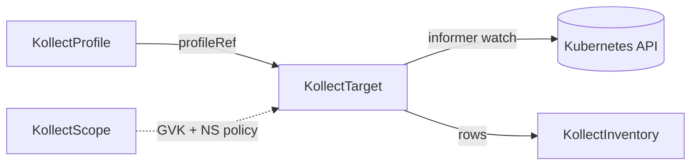

# KollectTarget

**Scope:** Namespace · **Reconciled:** Yes · **Short name:** `ktgt`

!!! tip "Same-namespace profileRef"
    `spec.profileRef` must name a `KollectProfile` in the **same namespace** as the target. Platform
    cross-namespace collection uses `KollectClusterTarget` instead.

## What it is for

A `KollectTarget` binds a `KollectProfile` to **which** resources to watch: workload namespaces,
label selectors, explicit names, and watch-mode policy. The target controller registers a shared
informer for the profile GVK (one per GVK cluster-wide) and filters events per target selectors.

This is the **default team-scoped** collection object. Platform cross-namespace collection uses
`KollectClusterTarget` instead.

See [ADR-0301](../adr/0301-event-driven-informers.md),
[ADR-0205](../adr/0205-watch-labels.md), [ADR-0207](../adr/0207-target-collection-filtering.md).

## How it fits the pipeline



| Relationship | Rule |
| --- | --- |
| Profile | `spec.profileRef` — same namespace, required |
| Scope | Optional; when present enforces GVK and workload namespaces |
| Inventory | All targets in namespace aggregate into `KollectInventory` |
| Sink | Target status reflects namespace sink reachability for export path |

Collection diagram: [DATA-FLOWS.md §2](../DATA-FLOWS.md#2-collection-pipeline).

## Spec fields

| Field | Type | Required | Description |
| --- | --- | --- | --- |
| `spec.profileRef` | string | Yes | `KollectProfile` name in same namespace |
| `spec.namespaceSelector` | labelSelector | No | Restrict collected workload namespaces |
| `spec.includedNamespaces[]` | list | No | Static namespace allowlist (AND with selector) |
| `spec.excludedNamespaces[]` | list | No | Static namespace denylist |
| `spec.namespaceExcludeSelector` | labelSelector | No | Label-based namespace exclude |
| `spec.resourceRules[]` | list | No | GVK + label/CEL rules (OR union); empty → legacy selectors |
| `spec.labelSelector` | labelSelector | No | Legacy resource label filter when `resourceRules` empty |
| `spec.names[]` | list | No | Explicit resource names |
| `spec.suspend` | bool | No | Pause reconciliation |
| `spec.watchMode` | enum | No | `All` (default) or `OptIn` — see watch labels |

## Example

A target that binds the `deployment-images` profile to workloads labelled
`app.kubernetes.io/name=nginx`
([`config/samples/kollect_v1alpha1_kollecttarget.yaml`](https://github.com/konih/kollect/blob/main/config/samples/kollect_v1alpha1_kollecttarget.yaml)):

```yaml
apiVersion: kollect.dev/v1alpha1
kind: KollectTarget
metadata:
  name: nginx-deployments
  namespace: default
spec:
  profileRef: deployment-images
  labelSelector:
    matchLabels:
      app.kubernetes.io/name: nginx
  suspend: false
```

Opt-in watch and Argo/Helm targets live alongside it in
[`config/samples/`](https://github.com/konih/kollect/tree/main/config/samples)
(`*_kollecttarget_opt-in.yaml`, `*_argo-applications.yaml`, `*_helm-releases.yaml`).

## Sample usage

Basic Deployment collection:

```sh
kubectl apply -f config/samples/kollect_v1alpha1_kollectprofile.yaml
kubectl apply -f config/samples/kollect_v1alpha1_kollecttarget.yaml

# Optional workload
kubectl create deployment nginx --image=nginx:1.27
kubectl label deployment nginx app.kubernetes.io/name=nginx --overwrite

kubectl get ktgt -n default nginx-deployments -w
kubectl describe ktgt nginx-deployments -n default
```

**Opt-in** watch mode (only `kollect.dev/watch: enabled`):

```sh
kubectl apply -f config/samples/kollect_v1alpha1_kollecttarget_opt-in.yaml
```

**Argo CD Applications**:

```sh
kubectl apply -f config/samples/kollect_v1alpha1_kollectprofile_argo-application-summary.yaml
kubectl apply -f config/samples/kollect_v1alpha1_kollecttarget_argo-applications.yaml
```

**Helm releases** (Flux):

```sh
kubectl apply -f config/samples/kollect_v1alpha1_kollectprofile_helm-release-summary.yaml
kubectl apply -f config/samples/kollect_v1alpha1_kollecttarget_helm-releases.yaml
```

## Status conditions

| Type | When set | Meaning | Remediation |
| --- | --- | --- | --- |
| `Ready=True` | Collecting | Profile resolved; informer registered | None |
| `Synced=True` | Healthy | `reason`: `Collecting` with item count | Monitor `status` message |
| `Degraded=True` | Blocked | See `reason` below | Fix root cause; generation bump re-reconciles |
| `SinkReachable=True/False` | Export path | Namespace inventory family sinks reachable | Fix [KollectSnapshotSink](kollectsnapshotsink.md), [KollectDatabaseSink](kollectdatabasesink.md), or [KollectEventSink](kollecteventsink.md) connection |

### Common `Degraded` reasons

| Reason | Cause | Fix |
| --- | --- | --- |
| `Suspended` | `spec.suspend: true` | Set `suspend: false` |
| `MissingProfileRef` | Empty `profileRef` | Set valid profile name |
| `ProfileNotFound` | No matching profile | `kubectl apply` profile in same namespace |
| `ScopeGVKDenied` | GVK not allowed | Update [KollectScope](kollectscope.md) `allowedGVKs` |
| `ScopeNamespaceDenied` | Workload NS blocked | Add namespace to `allowedNamespaces` |
| `ScopeLookupFailed` | API error loading scope | Check RBAC; apiserver health |
| `InformerRegistrationFailed` | Dynamic client / GVK error | Verify CRD installed; check operator logs |
| `Forbidden` | SAR denied list in scoped NS | Grant operator read on target GVK in workload namespaces |
| `SinkNotFound` / `SinkUnreachable` | Inventory sink broken | Fix sink CR and connection test |

## RBAC

| Actor | Verbs | Resource | Notes |
| --- | --- | --- | --- |
| Team engineers | `get`, `list`, `watch`, `create`, `update`, `patch`, `delete` | `kollecttargets` | Tenant namespace |
| Operator | `get`, `list`, `watch` | `kollecttargets`, `kollectprofiles`, `kollectscopes`, `kollectsnapshotsinks`, `kollectdatabasesinks`, `kollecteventsinks` | Reconcile |
| Operator | `get`, `list`, `watch` | Target GVK resources | Dynamic — per profile (e.g. `deployments`) |
| Operator | `update`, `patch` | `kollecttargets/status` | Write conditions |

In **tenant mode**, Helm restricts the operator to `watchNamespaces`; targets still need SAR success
for each workload namespace they scrape.

## Common failure modes

| Symptom | Likely cause | Fix |
| --- | --- | --- |
| `itemCount` stays 0 | Label selector mismatch | `kubectl get deploy -l app.kubernetes.io/name=nginx` |
| Namespace skipped | Watch label / annotation | See [ADR-0205](../adr/0205-watch-labels.md); check `kollect.dev/watch` |
| `Forbidden` partial collection | RBAC too narrow | Extend ClusterRole or use namespace-scoped RoleBindings |
| Target in wrong namespace | Namespaced kind | `kubectl get ktgt -A`; match profile namespace |
| No reconcile after profile edit | Secondary watch pending | Bump target generation or wait for beta watch |
| `OptIn` collects nothing | Missing `enabled` label | Label namespace or resource `kollect.dev/watch: enabled` |

## See also

- [KollectProfile](kollectprofile.md)
- [KollectInventory](kollectinventory.md)
- [KollectScope](kollectscope.md)
- [DATA-FLOWS.md](../DATA-FLOWS.md)
- [examples/deployment-inventory.md](../examples/deployment-inventory.md)
