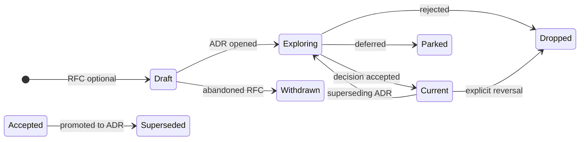

# Architecture Decision Records (ADRs) and RFCs

How Kollect captures **design decisions** and **pre-decision exploration** in public documentation.
The ADR corpus is the long-lived record; RFCs are optional scratch space before a decision is locked.

**Related:** [ADR index](../adr/README.md) · [Platform decisions](../PLATFORM-DECISIONS.md) ·
[Engineering guidelines](guidelines.md) · [Contributing](https://github.com/platformrelay/kollect/blob/main/CONTRIBUTING.md)

## When to write what

| Artifact | Use when | Audience |
| --- | --- | --- |
| **RFC** (optional) | Problem is understood but **options are still open**; you want review before committing API or architecture | Contributors, early reviewers |
| **ADR** | A **decision is made** (or explicitly rejected/deferred) and should survive implementation churn | Everyone — docs site, reviewers, future maintainers |
| **Neither** | Bug fix, typo, test-only change, or behavior already covered by an existing ADR | — |

Write an ADR when a change affects **any** of:

- CRD shape, validation, or conversion strategy
- Sink/export contracts, security boundaries, or multi-cluster topology
- Performance or cardinality assumptions documented in [PERFORMANCE.md](../PERFORMANCE.md)
- Rejected scope (prevents re-litigation — see [ADR-0702](../adr/0702-doc-sync-templating.md))

Small implementation details that follow an existing ADR belong in code comments or the CR reference —
not a new ADR.

### RFC vs ADR in practice

Kollect does **not** require a separate RFC for every ADR. Many records start life as ADRs with status
**Exploring** (for example [ADR-0304](../adr/0304-custom-resource-aggregation-rfc.md),
[ADR-0501](../adr/0501-multi-cluster-fleet.md)). Use a standalone RFC under [`docs/rfc/`](../rfc/README.md)
when:

- The write-up is long, speculative, or option-heavy and would clutter the ADR index
- Multiple ADRs might spin out of one exploration
- You want feedback **before** reserving an ADR number

When the decision stabilizes, **promote** the RFC: either merge its content into a new ADR or mark the
RFC superseded and link to the accepted ADR.

## Numbering scheme

ADRs use **thematic ranges** — `0Txx` where `T` is the theme digit:

| Range | Theme | Examples |
| --- | --- | --- |
| **01xx** | Foundations | Kubebuilder, security model, etcd limits |
| **02xx** | API & tenancy | CRD model, namespaced profiles, scope |
| **03xx** | Collection & extraction | Informers, CEL/JSONPath, aggregation |
| **04xx** | Export & sinks | Taxonomy, Postgres/Kafka, registry, Read API |
| **05xx** | Multi-cluster fleet | Shared sink fan-in (`spec.cluster`) |
| **06xx** | Observability & ops | Metrics, errors, performance |
| **07xx** | Project & meta | Docs site, release engineering, testing gates |

**Rules:**

1. Pick the **lowest free number** in the correct theme (gaps are allowed).
2. **Sink backends** belong in **04xx** (same theme as [ADR-0401](../adr/0401-sink-taxonomy-state-vs-stream.md)).
3. **Do not renumber** published ADRs without a maintainer consensus note in [adr/README.md](../adr/README.md)
   (pre-beta we optimize for readable corpus over immutable history).
4. Filename: `docs/adr/0Txx-short-slug.md` — slug is kebab-case, stable after merge.

RFCs use **descriptive slugs only** (no number): `docs/rfc/<topic-slug>.md`.

## Status vocabulary

Each ADR declares a **Status** in its header (see [adr/README.md](../adr/README.md)):

| Status | Meaning |
| --- | --- |
| **Current** | Decision in effect; implementation should match |
| **Exploring** | Direction under active design; may change |
| **Parked** | Deferred intentionally; revisit when triggers in ADR are met |
| **Dropped** | Decided against; binding guardrail (still documented) |

RFCs use a simpler lifecycle label in their title block: **Draft** · **Review** · **Accepted** ·
**Superseded** · **Withdrawn**.

## Lifecycle



1. **Proposed** — PR adds `docs/rfc/…` and/or `docs/adr/0Txx-….md` with status **Exploring** or RFC **Draft**.
2. **Review** — discussion in PR; link from [planned features](../roadmap/planned-features.md) or
   [ROADMAP.md](../ROADMAP.md) if user-visible.
3. **Accepted** — merge with status **Current** (or RFC **Accepted** + companion ADR).
4. **Superseded** — old ADR keeps history; add *Superseded by* `[ADR-0yyy](…)` at the top and update
   [adr/README.md](../adr/README.md) table.
5. **Implementation** — update [ROADMAP.md](../ROADMAP.md) checkmarks; CR docs in `docs/crds/` when API
   ships.

## Where files live

| Path | Purpose |
| --- | --- |
| [`docs/adr/`](../adr/README.md) | Numbered ADRs — canonical decisions |
| [`docs/rfc/`](../rfc/README.md) | Optional pre-ADR proposals (unnumbered) |
| [`docs/roadmap/planned-features.md`](../roadmap/planned-features.md) | Backlog before ADR exists |
| [`docs/PLATFORM-DECISIONS.md`](../PLATFORM-DECISIONS.md) | Curated summary of locked choices (not a substitute for ADRs) |

Register new ADRs in **two** places:

1. The ADR file itself
2. The themed table in [docs/adr/README.md](../adr/README.md)
3. A nav entry in [`mkdocs.yml`](https://github.com/platformrelay/kollect/blob/main/mkdocs.yml) under *Reference → Architecture decision records*
   (maintainers — keeps the docs site searchable)

## ADR template

Copy into `docs/adr/0Txx-your-slug.md` and replace placeholders:

```markdown
# ADR-0Txx: Short title

> One-line summary of the decision.

**Theme:** 0T · Theme name · **Status:** Exploring | Current | Parked | Dropped

## Context

What problem are we solving? Link requirements, prior ADRs, and constraints.

## Decision

Numbered or headed subsections with the locked choice(s).

## Consequences

### Positive

- …

### Negative

- …

## Open questions

- … (remove section when status moves to Current)

## See also

- [ADR-….](….md)
- [REQUIREMENTS.md](../REQUIREMENTS.md)
```

**Style notes** (match existing corpus):

- Use **Context / Decision / Consequences** — architecture-first; no project timeline or session logs.
- Link sibling ADRs by relative path; link requirements and roadmap where relevant.
- Use admonitions sparingly; prefer tables for option comparisons.
- No private or internal-only paths in shipped docs.

## RFC template

Copy into `docs/rfc/your-topic-slug.md`:

```markdown
# RFC: Topic title

**Status:** Draft · **Author:** @github-handle · **Created:** YYYY-MM-DD

## Summary

Two–three sentences on the problem and proposed direction.

## Goals / non-goals

| Goals | Non-goals |
| --- | --- |
| … | … |

## Background

Links to ADRs, issues, or [planned features](../roadmap/planned-features.md) entries.

## Proposal

Main design — options table if still comparing.

## Alternatives considered

| Option | Pros | Cons |
| --- | --- | --- |
| … | … | … |

## Open questions

- …

## Promotion

When accepted, create **ADR-0Txx** and set this RFC to **Superseded** with a link.
```

## Review checklist

Before merging an ADR or RFC PR:

- [ ] Number in the correct **0Txx** theme (ADRs only)
- [ ] [adr/README.md](../adr/README.md) table row added or updated
- [ ] [mkdocs.yml](https://github.com/platformrelay/kollect/blob/main/mkdocs.yml) nav entry (ADRs)
- [ ] [ROADMAP.md](../ROADMAP.md) or [planned features](../roadmap/planned-features.md) cross-links if user-facing
- [ ] No secrets, internal hostnames, or non-public references
- [ ] `task verify` / docs CI green if CRD or generated docs touched

## See also

- [ADR index](../adr/README.md)
- [Planned features](../roadmap/planned-features.md)
- [Roadmap](../ROADMAP.md)
- [MkDocs site ADR](../adr/0701-mkdocs-github-pages.md)
