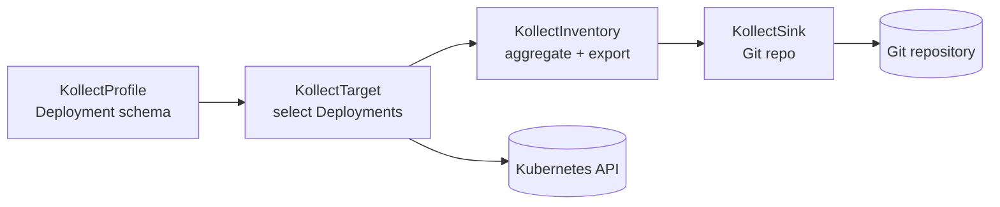

# Example: Deployment inventory to Git

This walkthrough connects the four core CRDs into a minimal pipeline: define **what** to extract
(`KollectProfile`), **where** to send it (`KollectSink`), **which** resources to watch
(`KollectTarget`), and **when** to aggregate and export (`KollectInventory`).

Files live in `config/samples/` and can be applied with `kubectl apply -k config/samples/`.

## Overview



## Step 1 — KollectProfile

Defines the GVK and attribute extraction rules. This example collects the container image and
metadata labels from `apps/v1` Deployments.

```yaml
apiVersion: kollect.dev/v1alpha1
kind: KollectProfile
metadata:
  name: deployment-images
spec:
  targetGVK:
    group: apps
    version: v1
    kind: Deployment
  attributes:
    - name: image
      path: '$.spec.template.spec.containers[0].image'
      type: string
    - name: labels
      path: '$.metadata.labels'
      type: map
      optional: true
```

**Expected behavior (Phase 1+):** the target controller loads this profile when resolving
`profileRef`. JSONPath runs against each cached Deployment object. Missing optional attributes do
not fail the row; required attributes surface extraction errors on the target status.

## Step 2 — KollectSink

Static configuration for a Git backend. Replace the endpoint with your inventory repository.

```yaml
apiVersion: kollect.dev/v1alpha1
kind: KollectSink
metadata:
  name: git-inventory-demo
spec:
  type: git
  endpoint: https://github.com/konih/kollect-inventory-demo.git
  # secretRef:
  #   name: git-push-credentials
  #   namespace: kollect-system
```

**Expected behavior (Phase 1+):** the inventory controller resolves `git` via the sink registry,
authenticates with `secretRef` when set, and commits deterministic JSON/YAML snapshots. Status
stores summary refs (commit SHA), not the full payload ([ADR-0006](../adr/0006-etcd-limit.md)).

**Today:** CR validates and persists; export requires sink implementation.

## Step 3 — KollectTarget

Namespaced resource that binds a profile to selectors. Deployed in `default` in the sample.

```yaml
apiVersion: kollect.dev/v1alpha1
kind: KollectTarget
metadata:
  name: nginx-deployments
  namespace: default
spec:
  profileRef: deployment-images
  labelSelector:
    matchLabels:
      app.kubernetes.io/name: nginx
  suspend: false
```

**Expected behavior (Phase 1+):**

1. Controller registers a dynamic informer for `apps/v1` Deployments (from the profile GVK).
2. Only Deployments matching `labelSelector` in the target namespace are collected.
3. Extracted rows feed the cluster inventory aggregator.

Create a matching workload to exercise selection:

```sh
kubectl create deployment nginx --image=nginx:1.27
kubectl label deployment nginx app.kubernetes.io/name=nginx --overwrite
```

**Today:** reconcile loop may no-op until informer wiring lands; CR should accept the spec.

## Step 4 — KollectInventory

Namespaced aggregator (same namespace as targets) referencing one or more sinks.

```yaml
apiVersion: kollect.dev/v1alpha1
kind: KollectInventory
metadata:
  name: team-inventory
  namespace: default
spec:
  sinkRefs:
    - git-inventory-demo
  suspend: false
```

**Expected behavior (Phase 1+):**

- `status.itemCount` reflects aggregated rows from all active targets.
- `status.lastExportTime` updates after a successful Git push.
- Conditions: `Ready` / `Synced` / `Degraded` per [error taxonomy](../adr/0020-error-taxonomy.md).

**Today:** status fields remain empty until aggregation and export are implemented.

## Apply everything

```sh
kubectl apply -k config/samples/
kubectl get kprof,ksink,ktgt -A,kinv
```

## Troubleshooting

| Symptom | Likely cause |
| --- | --- |
| Target not found | `KollectTarget` is namespaced — ensure namespace matches |
| Profile not found | `profileRef` must name an existing cluster `KollectProfile` |
| No export in Git | Phase 1 sink not implemented yet, or missing `secretRef` |
| Empty item count | No Deployments match selector, or informer not registered |

See [QUICKSTART.md](../QUICKSTART.md) and [DEVELOPMENT.md](../DEVELOPMENT.md) for cluster setup
and log inspection.
