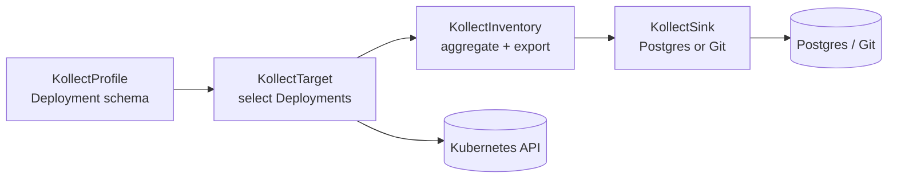

# Example: Deployment inventory

This walkthrough connects the four core **namespaced** CRDs into a minimal pipeline: define **what**
to extract (`KollectProfile`), **where** to send it (`KollectSink`), **which** resources to watch
(`KollectTarget`), and **when** to aggregate and export (`KollectInventory`). There is **no
`KollectHub` CRD** — hub aggregation uses Helm `mode: hub` ([ADR-0703](../adr/0703-platform-architecture-pivot.md)).

**Default sample path:** Postgres state store (`postgres-inventory-demo`). Swap to `git-inventory-demo`
for Git audit/CI. See [Postgres state store](postgres-state-store.md) and
[Connection test](connection-test.md).

Files live in `config/samples/` and can be applied with `kubectl apply -k config/samples/`.

## Overview



## Scale

The collection path targets **100,000+** watched objects per spoke (typical Deployment/Service
profiles). Tune namespace-scoped informers, `KollectInventory.spec.exportMinInterval` (default
**30s**), and operator reconcile parallelism per [PERFORMANCE.md](../PERFORMANCE.md) and
[ADR-0603](../adr/0603-performance-scalability.md).

## Step 1 — KollectProfile

Defines the GVK and attribute extraction rules. This example collects container images and metadata
labels from `apps/v1` Deployments.

Sample: `config/samples/kollect_v1alpha1_kollectprofile.yaml`

```yaml
apiVersion: kollect.dev/v1alpha1
kind: KollectProfile
metadata:
  name: deployment-images
  namespace: default
spec:
  targetGVK:
    group: apps
    version: v1
    kind: Deployment
  attributes:
    - name: image
      path: '$.spec.template.spec.containers[0].image'
      type: string
    - name: images
      path: '$.spec.template.spec.containers[*].image'
      type: list
    - name: containerCount
      path: "cel:size(object.spec.template.spec.containers)"
      type: int
    - name: labels
      path: '$.metadata.labels'
      type: map
      optional: true
```

**Behavior:** the target controller loads this profile when resolving `profileRef`. JSONPath and CEL
run against each cached Deployment object. Missing optional attributes do not fail the row; required
attributes surface extraction errors on the target status.

### All container images (`[*]` wildcard)

Multi-container Deployments need every image, not only the first. Use the kubectl JSONPath wildcard
**`[*]`** (not `[ ALL ]` or bare `[]`):

| Path | Export value (2 containers) |
| --- | --- |
| `$.spec.template.spec.containers[0].image` | `"nginx:1.25"` (scalar) |
| `$.spec.template.spec.containers[*].image` | `["nginx:1.25", "sidecar:0.1"]` (JSON array) |

Set `type: list` on multi-value attributes. CEL equivalent:
`cel:object.spec.template.spec.containers.map(c, c.image)`.

See [DATA-FLOWS.md](../DATA-FLOWS.md#3-attribute-extraction-jsonpath-arrays) and
[ADR-0302](../adr/0302-cel-jsonpath-extraction.md).

## Step 2 — KollectSink

`KollectSink` is **namespaced** — create sinks in the same namespace as `KollectInventory`
`sinkRefs` ([ADR-0703](../adr/0703-platform-architecture-pivot.md)).

### Postgres (default sample)

`config/samples/kollect_v1alpha1_kollectsink_postgres.yaml`

```yaml
apiVersion: kollect.dev/v1alpha1
kind: KollectSink
metadata:
  name: postgres-inventory-demo
  namespace: default
spec:
  type: postgres
  cluster: kind-kollect-dev
  connectionTest: true
  postgres:
    databaseRef:
      name: inventory-postgres-dsn
      namespace: kollect-system
    schema: public
    table: inventory_items
```

Create the DSN secret before export — see [Postgres state store](postgres-state-store.md).

### Git (audit / CI)

`config/samples/kollect_v1alpha1_kollectsink.yaml`

```yaml
apiVersion: kollect.dev/v1alpha1
kind: KollectSink
metadata:
  name: git-inventory-demo
  namespace: default
spec:
  type: git
  endpoint: https://github.com/konih/kollect-inventory-demo.git
  connectionTest: true
  # secretRef:
  #   name: git-push-credentials
  #   namespace: kollect-system
```

**Behavior:** the inventory controller resolves sinks via the registry (`git`, `postgres`, `kafka`,
`gitlab`, `s3`, `gcs`). With `connectionTest: true`, the operator probes on create/update and sets
`ConnectionVerified` on the sink. Export commits deterministic JSON snapshots to Git or upserts rows
to Postgres; status stores summary refs (commit SHA), not the full payload
([ADR-0103](../adr/0103-etcd-limit.md)).

Production installs should set `connectionTest: false` (chart default) and re-probe on demand —
see [Connection test](connection-test.md).

## Step 3 — KollectTarget

Namespaced resource that binds a profile to selectors. Deployed in `default` in the sample.

`config/samples/kollect_v1alpha1_kollecttarget.yaml`

```yaml
apiVersion: kollect.dev/v1alpha1
kind: KollectTarget
metadata:
  name: nginx-deployments
  namespace: default
spec:
  profileRef: deployment-images
  labelSelector:
    matchLabels:
      app.kubernetes.io/name: nginx
  suspend: false
```

`profileRef` resolves a `KollectProfile` in the **same namespace** as the target
([ADR-0204](../adr/0204-namespaced-profiles.md)).

**Watch labels (optional):** set `spec.watchMode: OptIn` to collect only namespaces/resources
labeled `kollect.dev/watch: enabled`, or annotate a namespace with
`kollect.dev/namespace-watch: disabled` to skip all workloads in that namespace while keeping
`watchMode: All` (default). See [ADR-0205](../adr/0205-watch-labels.md).

```yaml
# Opt out an entire namespace (All mode)
apiVersion: v1
kind: Namespace
metadata:
  name: kube-system
  annotations:
    kollect.dev/namespace-watch: disabled
```

**Behavior:**

1. Controller registers a dynamic informer for `apps/v1` Deployments (from the profile GVK).
2. Only Deployments matching `labelSelector` in the target namespace are collected.
3. Extracted rows feed the namespace inventory aggregator.

Create a matching workload to exercise selection:

```sh
kubectl create deployment nginx --image=nginx:1.27
kubectl label deployment nginx app.kubernetes.io/name=nginx --overwrite
```

## Step 4 — KollectInventory

Namespaced aggregator (same namespace as targets) referencing one or more sinks.

`config/samples/kollect_v1alpha1_kollectinventory.yaml`

```yaml
apiVersion: kollect.dev/v1alpha1
kind: KollectInventory
metadata:
  name: team-inventory
  namespace: default
spec:
  sinkRefs:
    - postgres-inventory-demo
  suspend: false
```

Swap `sinkRefs` to `git-inventory-demo` for the Git audit path.

**Behavior:**

- `status.itemCount` reflects aggregated rows from all active targets in the namespace.
- `status.lastExportTime` updates after a successful export.
- Conditions: `Ready`, `Synced`, `SinkReachable`, `Degraded` per
  [error taxonomy](../adr/0602-error-taxonomy.md).

## Apply everything

```sh
kubectl apply -k config/samples/
kubectl get kprof,ksink,ktgt,kinv -A
```

Verify sink connectivity before relying on export:

```sh
kubectl wait --for=condition=ConnectionVerified kollectsink/postgres-inventory-demo \
  -n default --timeout=60s
kubectl describe kollectinventory team-inventory -n default
```

## Troubleshooting

| Symptom | Likely cause |
| --- | --- |
| Target not found | `KollectTarget` is namespaced — ensure namespace matches |
| Profile not found | `profileRef` must name a `KollectProfile` in the **same namespace** as the Target |
| Sink not found | `sinkRefs` must name a `KollectSink` in the **same namespace** as the Inventory |
| No export | Missing DSN/`secretRef`, `ConnectionVerified=False`, or `SinkReachable=False` with reason `SinkNotFound` / `SinkUnreachable` — see `kubectl describe kollectsink` and inventory `status.conditions` |
| Empty item count | No Deployments match selector, or target suspended / scope denied |
| Namespace skipped | `kollect.dev/namespace-watch: disabled` or `watchMode: OptIn` without `enabled` label |

See [Kind local lab](kind-local-lab.md), [QUICKSTART.md](../QUICKSTART.md), and
[DEVELOPMENT.md](../DEVELOPMENT.md) for cluster setup and log inspection.

## Related

- [Spoke cluster inventory](spoke-cluster-inventory.md) — Helm `mode: single` install narrative
- [Postgres state store](postgres-state-store.md) — DSN secret and delete reconciliation
- [Connection test](connection-test.md) — `ConnectionVerified` and `KollectConnectionTest`
- [KollectProfile](../crds/kollectprofile.md) · [KollectSink](../crds/kollectsink.md) ·
  [KollectTarget](../crds/kollecttarget.md) · [KollectInventory](../crds/kollectinventory.md)
- [CR reference](../CR-REFERENCE.md)
- [ADR-0703: Platform architecture pivot](../adr/0703-platform-architecture-pivot.md)
- [ADR-0603: Performance and scalability](../adr/0603-performance-scalability.md)
