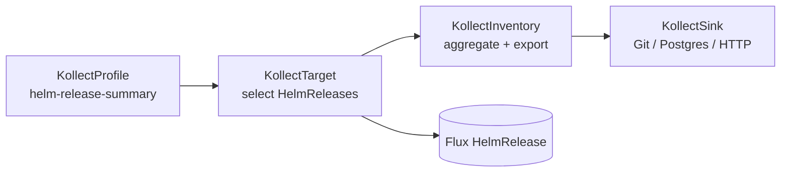

# Example: Helm release inventory (Flux)

This walkthrough inventories **chart version**, **app version**, and deployment metadata from Flux
`HelmRelease` objects. It follows the same four-CRD pipeline as
[Deployment inventory](deployment-inventory.md).

Design rationale and redaction policy: [ADR-0027](../adr/0027-helm-release-inventory.md).

## Overview



## Step 1 — KollectProfile

Targets **`helm.toolkit.fluxcd.io/v2` / `HelmRelease`**. Exports only the **summary tier**—no
`spec.values`. Use `valuesChecksum` (`status.lastAttemptedConfigDigest`) to detect config drift
without publishing secrets.

Sample manifest: `config/samples/kollect_v1alpha1_kollectprofile_helm-release-summary.yaml`

Example target: `config/samples/kollect_v1alpha1_kollecttarget_helm-releases.yaml`

```yaml
apiVersion: kollect.dev/v1alpha1
kind: KollectProfile
metadata:
  name: helm-release-summary
spec:
  targetGVK:
    group: helm.toolkit.fluxcd.io
    version: v2
    kind: HelmRelease
  attributes:
    - name: chartVersion
      path: '$.status.history[0].chartVersion'
      type: string
      optional: true
    - name: appVersion
      path: '$.status.history[0].appVersion'
      type: string
      optional: true
    - name: valuesChecksum
      path: '$.status.lastAttemptedConfigDigest'
      type: string
      optional: true
    - name: imageTag
      path: '$.spec.values.image.tag'
      type: string
      optional: true
```

**Note:** In generic-chart GitOps, `appVersion` in chart metadata may be stale. The optional
`imageTag` attribute surfaces the running application version from values when present.

## Step 2 — KollectTarget

Scope HelmReleases to the namespaces your team owns. Example label selector (adjust to your labels):

```yaml
apiVersion: kollect.dev/v1alpha1
kind: KollectTarget
metadata:
  name: team-helm-releases
  namespace: my-team
spec:
  profileRef: helm-release-summary
  namespaceSelector:
    matchLabels:
      team: my-team
```

## Step 3 — Values profile (platform teams only)

Deployed **values** are **not** in the public sample. When operator scrub and `KollectScope`
governance land, a separate profile `helm-release-values-redacted` may add `spec.values` with
key-based redaction (passwords, tokens, `secretKeyRef`, etc.) and export to a **private** sink.

Until scrub exists, do not add `spec.values` to profiles that export to public Git.

## Plain Helm (no Flux)

Clusters using `helm install` store releases in **`helm.sh/v1` Secrets** (`owner=helm`). That GVK
is a **secondary** target documented in ADR-0027. It requires a future `helm:` decode path in the
extractor—JSONPath on the Secret object cannot read `appVersion` from the opaque `data.release` blob.

## Related

- [ADR-0027: Helm release inventory](../adr/0027-helm-release-inventory.md)
- [Deployment inventory example](deployment-inventory.md)
- [Flux HelmRelease API](https://fluxcd.io/flux/components/helm/api/v2/)
