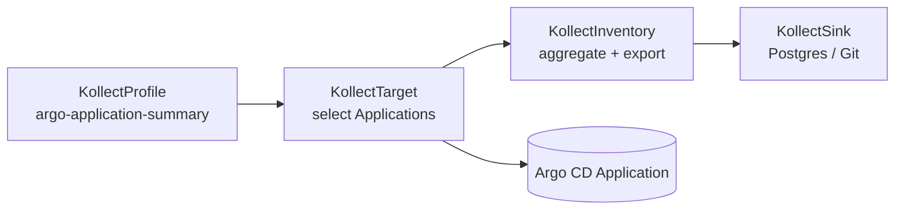

# Example: Helm / Argo release inventory

!!! tip "Argo CD basics"
    This walkthrough inventories [Argo CD](https://argo-cd.readthedocs.io/) `Application` CRs. You
    need Argo CD installed and at least one synced `Application` in a namespace your target can
    watch. For Argo CD concepts and CLI usage, see the
    [upstream documentation](https://argo-cd.readthedocs.io/en/stable/).

This walkthrough inventories **chart version**, **app version**, and sync metadata from Argo CD
`Application` objects. It follows the same four-CRD pipeline as
[Deployment inventory](deployment-inventory.md).

**Primary demo GVK (ADR-0703):** `argoproj.io/v1alpha1` / `Application`. Contract test:
`internal/collect/argo_application_contract_test.go`. Design rationale:
[ADR-0303](../adr/0303-helm-release-inventory.md).

## Overview



## Step 1 — KollectProfile

!!! note "Summary tier only"
    Targets **`argoproj.io/v1alpha1` / `Application`**. Extracts chart and sync metadata — not
    `spec.source.helm.values`. Full values inventory requires a future `helm:` decode path
    ([ADR-0303](../adr/0303-helm-release-inventory.md)).

Sample: `config/samples/kollect_v1alpha1_kollectprofile_argo-application-summary.yaml`

```yaml
apiVersion: kollect.dev/v1alpha1
kind: KollectProfile
metadata:
  name: argo-application-summary
  namespace: default
spec:
  targetGVK:
    group: argoproj.io
    version: v1alpha1
    kind: Application
  attributes:
    - name: chart
      path: '$.spec.source.chart'
      type: string
      optional: true
    - name: chartVersion
      path: '$.status.sync.revision'
      type: string
      optional: true
    - name: syncStatus
      path: '$.status.sync.status'
      type: string
      optional: true
```

## Step 2 — KollectSink

Namespaced ([ADR-0703](../adr/0703-platform-architecture-pivot.md)). Default inventory uses Postgres:
`config/samples/kollect_v1alpha1_kollectsink_postgres.yaml`. See [Postgres state store](postgres-state-store.md).

## Step 3 — KollectTarget

`config/samples/kollect_v1alpha1_kollecttarget_argo-applications.yaml`

```yaml
spec:
  profileRef: argo-application-summary
  namespaceSelector:
    matchLabels:
      argocd.argoproj.io/instance: team-a
```

`profileRef` resolves in the **same namespace** as the target.

## Step 4 — KollectInventory

`config/samples/kollect_v1alpha1_kollectinventory.yaml` — `sinkRefs: [postgres-inventory-demo]`.

## Apply

```sh
kubectl apply -k config/samples/
```

## Flux HelmRelease (secondary)

| File | Purpose |
| --- | --- |
| `kollect_v1alpha1_kollectprofile_helm-release-summary.yaml` | Flux summary profile |
| `kollect_v1alpha1_kollecttarget_helm-releases.yaml` | Flux target |

| Attribute | Path |
| --- | --- |
| `chartVersion` | `$.status.lastAttemptedRevision` |
| `appVersion` | `$.status.history[0].appVersion` |
| `valuesChecksum` | `$.status.lastAttemptedConfigDigest` |

## Troubleshooting

!!! warning "Optional attributes"
    `chartVersion` and `syncStatus` are marked `optional: true` — empty export rows are normal when
    an Application has not synced yet. Check `kubectl get application -A` before assuming a profile bug.

| Symptom | Likely cause |
| --- | --- |
| Profile not found | `profileRef` must be in same namespace as target |
| Empty chartVersion | Application not synced (`optional: true`) |
| No export | Postgres DSN missing or `ConnectionVerified=False` |

## Related

- [ADR-0303](../adr/0303-helm-release-inventory.md) · [Deployment inventory](deployment-inventory.md)
