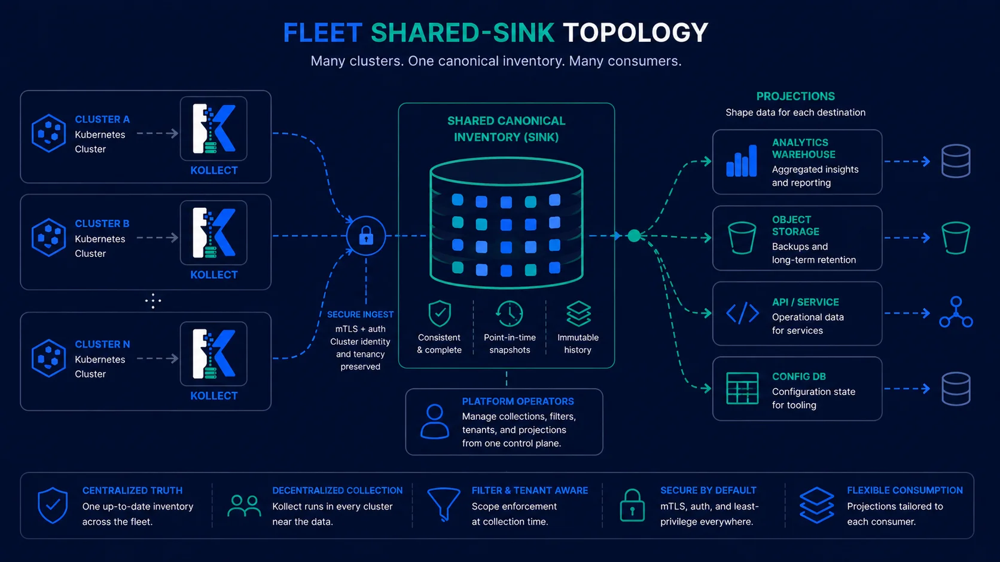

# Example: Spoke cluster inventory

!!! info "Single-cluster default"
    Most teams start here: one cluster, namespaced CRDs, export to Postgres or Git. Hub aggregation
    is optional and documented separately in [Hub mode](hub-mode.md).

Install Kollect on a **single cluster** with Helm `mode: single` — the default path before hub
aggregation. Teams run namespaced Profile → Target → Inventory → Sink and export to Postgres or
Kafka for portal queries
([ADR-0703](../adr/0703-platform-architecture-pivot.md),
[ADR-0501](../adr/0501-multi-cluster-sync-rfc.md)).

{ .kollect-illus .kollect-illus--wide width="800" }

There is **no `KollectHub` CRD**. Hub merge uses `mode: hub` on a management cluster
([charts/kollect/README.md](../../charts/kollect/README.md)).

## Step 1 — Install operator

**Per-team** (recommended):

```yaml
tenantMode: true
watchNamespaces:
  - team-a
mode: single
featureGates:
  inventoryHttp:
    enabled: false
```

```sh
helm install kollect ./charts/kollect -n kollect-system --create-namespace \
  -f values-team-a.yaml
```

Local dev: `task kind-dev-up` ([Kind local lab](kind-local-lab.md)).

## Step 2 — Postgres backend

Create DSN secret and apply samples — [Postgres state store](postgres-state-store.md).

```sh
kubectl apply -k config/samples/
kubectl wait --for=condition=ConnectionVerified kollectsink/postgres-inventory-demo \
  -n default --timeout=60s
```

Set `spec.cluster` on the sink for shared-database fan-in across spokes.

## Step 3 — Collection pipeline

Full walkthrough: [Deployment inventory](deployment-inventory.md).

E2e without live backends: `config/samples/e2e/team-inventory.yaml` (no family sink refs).

## Hub-and-spoke upgrade

!!! note "No KollectHub CRD"
    Hub merge uses Helm `mode: hub` on the same operator image — there is no `KollectHub` custom
    resource. See [ADR-0703](../adr/0703-platform-architecture-pivot.md).

1. Spokes: `mode: spoke` — local collect + export.
2. Hub: `mode: hub` + merge lib ([Hub mode](hub-mode.md)).
3. Register spokes with `KollectRemoteCluster` ([ADR-0503](../adr/0503-hub-cluster-auth-istio-pattern.md)).

## Related

- [Deployment inventory](deployment-inventory.md) · [Connection test](connection-test.md)
- [ADR-0703](../adr/0703-platform-architecture-pivot.md)
