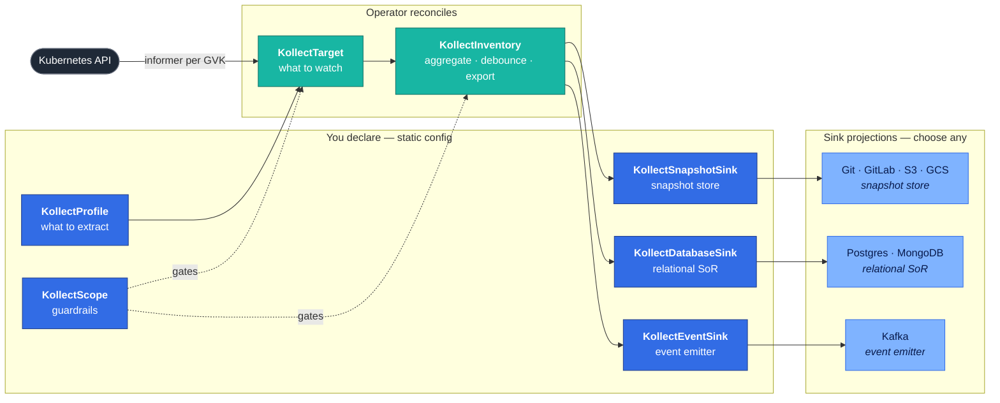

---
hide:
  - navigation
  - toc
  - title
---

{ .kollect-hero-logo }

 

 

**Your cluster, in Git, diffable.** Declare GVK + CEL in CRDs and get a clean, Git-committed
inventory — when the cluster changes, the inventory commits change; `git log` is your audit trail
and `git diff` is your drift report. **Git export is the hero** — Postgres and every other sink get
the same rows in parallel, for free. Portals, automation, and auditors read **export data**, not
unbounded list/watch against the live API.

Record the hero demo locally: [DEMO-GIF-GUIDE.md](DEMO-GIF-GUIDE.md).

`kollect.dev/v1alpha1` · event-driven · CRD-native · fleet-ready

[Quick start :octicons-arrow-right-24:](QUICKSTART.md){ .md-button .md-button--primary }
[CR reference :octicons-arrow-right-24:](CR-REFERENCE.md){ .md-button }

## What Kollect does

Kubernetes is the source of truth for *what is running*; it is a poor *system of record* for
stakeholder inventory. Kollect maintains a **read model** — live state captured once, then served
from export data:

**Scope** and **Target** select resources by GVK and namespace; **Profile** extracts the attributes
that matter (CEL or JSONPath); **Inventory** rolls up matching objects, **debounces** churn, and
**exports** snapshots to pluggable sinks (Git, object stores, databases, event streams). Every
backend sees the same aggregated rows; sinks are interchangeable projections.

Inventory is **configuration, not code** — owned per team in its own namespace.

!!! warning "Pre-beta"
    APIs and defaults may change until the first release candidate. See the
    [roadmap](ROADMAP.md) for current status.

## Why Kollect?

### :material-radar: Event-driven

Shared informers per GVK — inventory stays current without polling loops
([ADR-0301](adr/0301-event-driven-informers.md)).

### :material-cube-outline: CRD-native

Declare profiles, sinks, targets, and inventory in Kubernetes; GitOps-friendly from day one.

### :material-account-group: Multi-tenant

`KollectScope` gates which teams and namespaces can export to which sinks.

### :material-hub: Fleet-ready

Each cluster runs `mode: single` and exports to **shared sinks** with a cluster label
([ADR-0501](adr/0501-multi-cluster-fleet.md)).

## How it works

{ .kollect-illus .kollect-illus--wide }

The in-memory snapshot per inventory is **canonical**; every sink is a **projection** of it — no
single backend is privileged. Sink roles (snapshot store, relational store, event emitter) are
documented in [ADR-0401](adr/0401-sink-taxonomy-state-vs-stream.md); reconciliation detail in
[Architecture](ARCHITECTURE.md) and [Data flows](DATA-FLOWS.md).

### Supported & planned sinks

| Family CRD | `spec.type` | Status |
| --- | --- | --- |
| `KollectSnapshotSink` | `git`, `gitlab`, `s3` | **Core** — production-ready |
| `KollectSnapshotSink` | `gcs` | **Beta** — shipped, maturing |
| `KollectDatabaseSink` | `postgres` | **Core** |
| `KollectDatabaseSink` | `mongodb`, `bigquery` | **Beta** — `bigquery` v0.7.x hardening |
| `KollectEventSink` | `kafka`, `nats` | **Beta** — `nats` v0.7.x hardening |
| `KollectSnapshotSink` | `azureblob` | **Planned** |
| Object-store sinks | Parquet layout | **Planned** — on S3/GCS |

Release timing and deferred backends: [Roadmap — Supported & planned sinks](ROADMAP.md#supported-planned-sinks).

## The resource model

A pipeline is just a handful of Kubernetes resources: **config you declare** (`KollectProfile`,
family sinks — `KollectSnapshotSink`, `KollectDatabaseSink`, `KollectEventSink`, `KollectScope`)
and **objects the operator reconciles** (`KollectTarget`, `KollectInventory`). Cluster-scoped
`KollectCluster*` variants add cross-namespace rollup.

| Kind | You set | Role |
| --- | --- | --- |
| `KollectProfile` | GVK + CEL / JSONPath attributes | **What to extract** from each object |
| `KollectTarget` | selectors + `profileRef` | **What to watch** and collect |
| `KollectInventory` | family sink refs + cadence | **Aggregate, debounce, and export** |
| `KollectSnapshotSink` | type + endpoint + `secretRef` | **Snapshot store** (Git, GitLab, S3, GCS) |
| `KollectDatabaseSink` | type + credentials | **Relational SoR** (Postgres, MongoDB) |
| `KollectEventSink` | type + brokers | **Event emitter** (Kafka) |
| `KollectScope` | allowed GVKs / namespaces / sinks | **Guardrails** for the team namespace |

Full fields: [CR reference](CR-REFERENCE.md) · model rationale: [ADR-0201](adr/0201-crd-model.md).

## Performance

Kollect is built for **large single clusters** and **multi-cluster fleets**, with honest, tested
targets ([ADR-0603](adr/0603-performance-scalability.md)) — **10,000+** rows validated in nightly
load tests, **100,000-row** design target per cluster, and fleet fan-in with no hub merge tier.
Tuning knobs are catalogued in the [performance guide](PERFORMANCE.md).

## Documentation map

| Section | Start here |
| --- | --- |
| **Getting started** | [Quick start](QUICKSTART.md) · [Development setup](DEVELOPMENT.md) · [Examples](examples/README.md) |
| **Core concepts** | [CRD model](adr/0201-crd-model.md) · [CR reference](CR-REFERENCE.md) · [Multi-cluster fleet](adr/0501-multi-cluster-fleet.md) |
| **Operator manual** | [Install & ops](OPERATOR-MANUAL.md) · [Upgrading](operator-manual/upgrading.md) · [Helm values](operator-manual/helm-values.md) |
| **Performance & ops** | [Performance tuning](PERFORMANCE.md) · [Scaling & fleet](operator-manual/scaling-and-fleet.md) · [Best practices](BEST-PRACTICES.md) · [Troubleshooting](TROUBLESHOOTING.md) |
| **Background** | [Prerequisites & basics](UNDERSTAND-THE-BASICS.md) · [Architecture](ARCHITECTURE.md) ([package graph](architecture-graph.svg)) · [Data flows](DATA-FLOWS.md) |
| **Reference** | [Custom resources](CR-REFERENCE.md) · [FAQ](FAQ.md) · [ADRs](adr/README.md) · [RFCs](rfc/README.md) |
| **Contributing** | [Roadmap](ROADMAP.md) · [Planned features](roadmap/planned-features.md) · [ADR/RFC process](development/adr-rfc-process.md) · [Release process](RELEASE.md) |

## Try an example

- [Deployment inventory → Git / Postgres / Kafka](examples/deployment-inventory.md) — the end-to-end walkthrough
- [Postgres state store (relational SoR)](examples/postgres-state-store.md)
- [NATS event sink](examples/nats-event-sink.md)
- [Helm release inventory (Argo primary; Flux secondary)](examples/helm-release-inventory.md)
- [Live demo inventory exported to Git](https://github.com/konih/kollect-inventory-demo) — see real output

## Go deeper

- [Platform decisions](PLATFORM-DECISIONS.md) — the locked design summary
- [Sink taxonomy: state vs stream](adr/0401-sink-taxonomy-state-vs-stream.md) — why no backend is privileged
- [Read-only UI console (frozen preview)](operator-manual/ui.md) — early adopter SPA; program frozen until v0.7.x+
- [Roadmap](ROADMAP.md) — build-order phases and current status
