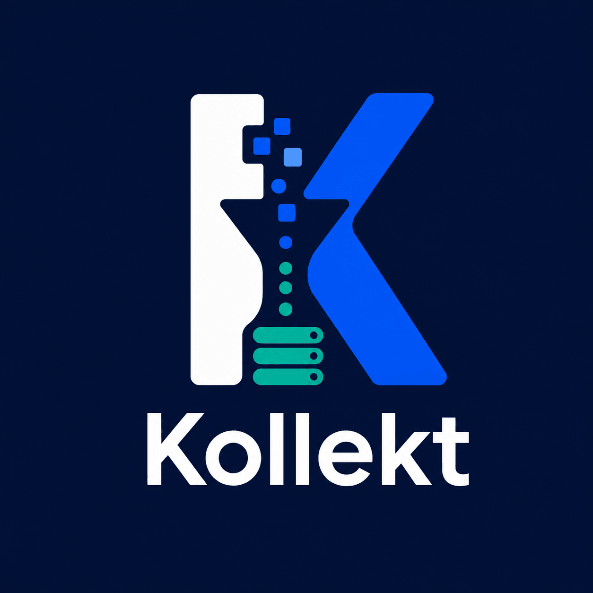

---
hide:
  - navigation
  - toc
  - title
---

<div class="kollect-hero" markdown="1">

{ .kollect-hero-logo }

**Kollect** turns selected, live cluster state into a **durable, queryable, diffable inventory** —
decoupled from the apiserver's availability, RBAC, and scale limits. Portals, automation, and
auditors read **export data**, not unbounded list/watch against the live API.

`kollect.dev/v1alpha1` · event-driven · CRD-native · fleet-ready

[Quick start :octicons-arrow-right-24:](QUICKSTART.md){ .md-button .md-button--primary }
[CR reference :octicons-arrow-right-24:](CR-REFERENCE.md){ .md-button }

</div>

[](https://securityscorecards.dev/viewer/?uri=github.com/konih/kollect)
[](https://github.com/konih/kollect/actions/workflows/ci.yaml)
[](https://codecov.io/gh/konih/kollect)
[](https://github.com/konih/kollect/actions/workflows/docs.yaml)
[](https://github.com/konih/kollect/blob/main/LICENSE)
[](https://pkg.go.dev/github.com/konih/kollect)
[](https://github.com/konih/kollect/pkgs/container/kollect)

## What Kollect does

Kubernetes is the source of truth for *what is running*; it is a poor *system of record* for
stakeholder inventory. Kollect maintains a **read model**:

**select** resources by GVK → **extract** the attributes that matter (CEL or JSONPath) →
**aggregate** across targets → **debounce** → **export** to pluggable sinks.

Inventory is **configuration, not code** — owned per team in its own namespace.

!!! warning "Pre-beta"
    APIs and defaults may change until the first release candidate. See the
    [roadmap](ROADMAP.md) for current status.

## How it works

```text
Kubernetes API  →  shared informer (per GVK)  →  in-memory collect store
       →  KollectInventory debounce  →  sink projection(s)
```

The in-memory snapshot per inventory is **canonical**; every sink is a **projection** of it — no
single backend is privileged. Sink roles (snapshot store, relational store, event emitter) are
documented in [ADR-0401](adr/0401-sink-taxonomy-state-vs-stream.md), not repeated here.

<div class="kollect-grid" markdown="1">

<div class="kollect-card" markdown="1">

### :material-radar: Event-driven

Shared informers per GVK — inventory stays current without polling loops
([ADR-0301](adr/0301-event-driven-informers.md)).

</div>

<div class="kollect-card" markdown="1">

### :material-cube-outline: CRD-native

Declare profiles, sinks, targets, and inventory in Kubernetes; GitOps-friendly from day one.

</div>

<div class="kollect-card" markdown="1">

### :material-account-group: Multi-tenant

`KollectScope` gates which teams and namespaces can export to which sinks.

</div>

<div class="kollect-card" markdown="1">

### :material-hub: Fleet-ready

Default path: spokes write to **shared sinks** with a cluster label. Optional **hub mode**
(`mode: hub|spoke` on the same image) for Git fan-in or credential centralization — **no hub CRD
required** ([ADR-0501](adr/0501-multi-cluster-sync-rfc.md)).

</div>

</div>

## Documentation map

| Section | Start here |
| --- | --- |
| **Understand the basics** | [Architecture](ARCHITECTURE.md) · [Data flows](DATA-FLOWS.md) · [Platform decisions](PLATFORM-DECISIONS.md) |
| **Core concepts** | [CRD model](adr/0201-crd-model.md) · [CR reference](CR-REFERENCE.md) · [Hub and spoke](adr/0501-multi-cluster-sync-rfc.md) |
| **Getting started** | [Quick start](QUICKSTART.md) · [Development setup](DEVELOPMENT.md) |
| **User guide** | [Deployment inventory example](examples/deployment-inventory.md) · [Performance tuning](PERFORMANCE.md) |
| **Reference** | [Custom resources](CR-REFERENCE.md) · [ADRs](adr/README.md) |
| **Contributing** | [Roadmap](ROADMAP.md) · [Release process](RELEASE.md) |

## Learn more

| Topic | Link |
| --- | --- |
| Problem statement, CRD model, reconciliation | [Architecture](ARCHITECTURE.md) |
| Locked platform decisions | [Platform decisions](PLATFORM-DECISIONS.md) |
| CR fields, RBAC, failure modes | [CR reference](CR-REFERENCE.md) |
| Multi-cluster & hub/spoke | [ADR-0501](adr/0501-multi-cluster-sync-rfc.md) |
| Sink taxonomy (state vs stream) | [ADR-0401](adr/0401-sink-taxonomy-state-vs-stream.md) |
| Build-order phases and status | [Roadmap](ROADMAP.md) |
| Read-only UI console (planned v0.2) | [ADR-0408](adr/0408-read-api-ui-architecture.md) · [ADR-0409](adr/0409-kollect-ui-deployment.md) |
| Examples index | [Examples](examples/README.md) |
| Example: Deployment → Git export | [Walkthrough](examples/deployment-inventory.md) |
| Live demo inventory (Git sink) | [kollect-inventory-demo](https://github.com/konih/kollect-inventory-demo) |

## Examples

- [Deployment inventory → Git / Postgres / Kafka](examples/deployment-inventory.md)
- [Postgres state store (relational SoR)](examples/postgres-state-store.md)
- [NATS event sink](examples/nats-event-sink.md)
- [Helm release inventory (Argo primary; Flux secondary)](examples/helm-release-inventory.md)
