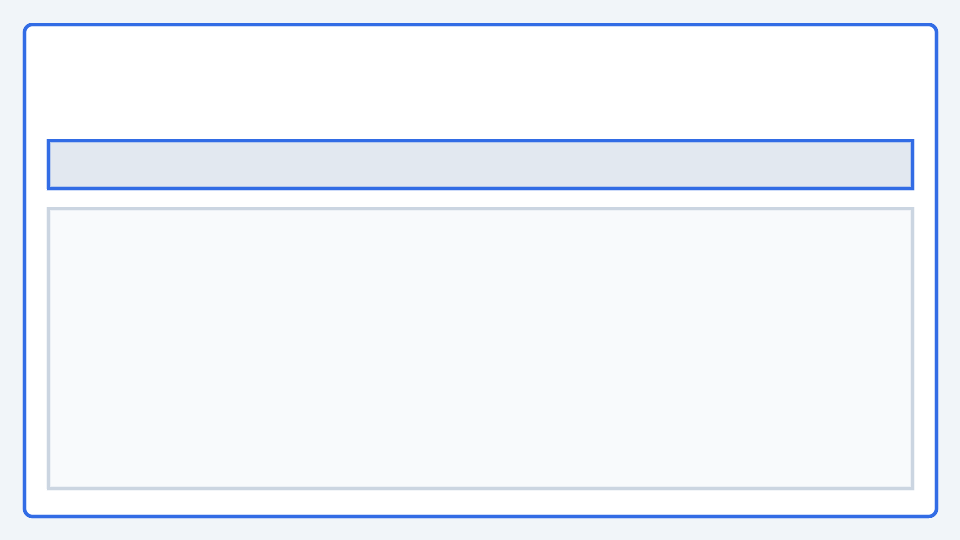

# Read-only UI (early adopter preview)

The **kollect-ui** SPA is a read-only console for inventory catalog browsing, export health, and
Target status — backed by the optional [Read API](../adr/0408-read-api-ui-architecture.md) (`/v1alpha1/*`).

!!! note "Versioning"
    **v0.3.x** shipped the sink-family backend ([ADR-0414](../adr/0414-sink-family-crds.md)). The
    read-only UI MVP is planned for the **v0.7.x** band per [VERSIONING-STRATEGY](../RELEASE.md#versioning-policy).
    The `ui/` tree on `main` is an **early adopter preview**: MSW mocks, Vitest, and Playwright smoke
    run in CI; production Helm wiring remains optional (`ui.enabled: false` by default).

## What it does today

| Route | Purpose |
| --- | --- |
| `/` | Overview — export status summary, degraded Target strip |
| `/inventory` | Filterable catalog, export-status chips, SSE live refresh, row detail drawer |
| `/targets` | Target health badges, conditions, read-only YAML drawer |
| `/sinks` | Per-sink export health from `exportStatus` on inventory summaries |

The UI reads **family sink CRDs** indirectly via export status (`snapshotSinkRefs`, `databaseSinkRefs`,
`eventSinkRefs` on `KollectInventory`) — not the removed monolithic `KollectSink` kind. There is **no**
hub/spoke cluster picker; single-cluster Read API only until portal mode ([ADR-0408](../adr/0408-read-api-ui-architecture.md)).

<!-- MAINTAINER-TODO: add screenshot of inventory list view -->


## Run locally (mock — no cluster)

From the repo root:

```bash
task ui-dev
```

Or from `ui/`:

```bash
npm ci
VITE_MOCK_API=true npm run dev
```

Open http://localhost:5173. MSW serves contract-faithful fixtures (team-a inventory, mixed export
status, degraded targets, 120-row pagination catalog). Append `?debug=true` for the connection banner.

See also [UI local development (mock vs live)](../examples/ui-local-development.md) and
[`ui/README.md`](../../ui/README.md).

## Run against a live Read API

Enable the inventory HTTP server on the operator (`featureGates.inventoryHttp.enabled: true`), then
port-forward (default `:8082`) and point the dev server at it:

```bash
VITE_MOCK_API=false VITE_READ_API_URL=http://127.0.0.1:8082 npm run dev
```

Requires RBAC with list/get on `kollectinventories` and `kollecttargets` — see
[ADR-0404 — Inventory HTTP API authentication](../adr/0404-inventory-api-auth.md).

Populate the cluster first — [Kind local lab](../examples/kind-local-lab.md) or
[Quick start](../QUICKSTART.md).

## OpenAPI contract

The Read API schema lives at [`openapi/v1alpha1/inventory.yaml`](../../openapi/v1alpha1/inventory.yaml).
The UI copies it to `ui/openapi/inventory.yaml` on `npm ci` (`postinstall`).

Key response fields for the UI:

- `InventorySummary.items` — collected catalog rows
- `InventorySummary.exportStatus` — per-sink export health (`ok` / `degraded` / `unknown`)
- `InventorySummary.pagination` — server-side paging
- `/v1alpha1/inventory/watch` — SSE snapshot stream for live refresh

## Deploy (optional)

Build the static image from the repo root:

```bash
docker build -f ui/Dockerfile -t ghcr.io/konih/kollect-ui:dev ui/
```

Helm subchart: `charts/kollect-ui/` — enable with `ui.enabled: true` on the parent chart.
Browser auth (oauth2-proxy) is post-MVP; see [ADR-0409](../adr/0409-kollect-ui-deployment.md).

## Quality gates

| Task | Purpose |
| --- | --- |
| `task ui-ci` | typecheck, Vitest, ESLint, production build, OpenAPI mock drift |
| `task ui-e2e` | Playwright smoke (`ui/e2e/smoke.spec.ts`, MSW dev server) |

Related ADRs: [0408](../adr/0408-read-api-ui-architecture.md) · [0409](../adr/0409-kollect-ui-deployment.md) ·
[0410](../adr/0410-ui-engineering-and-quality-gates.md) · [0412](../adr/0412-mock-read-api-for-ui-development.md)
