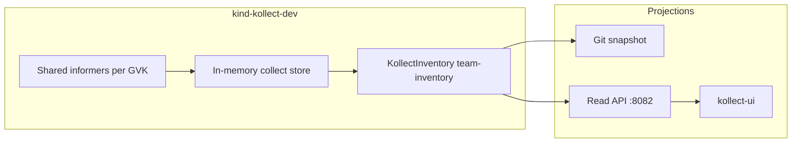

# Kollect wide-scope demo — sales pitch on kind

**Kollect** turns selected, live cluster state into a **durable, queryable, diffable inventory**.
This demo is the primary adoption story: a venue pitch and early-adopter lab from problem → answer →
live cluster → **UI reveal** + Git audit trail, exporting to
[github.com/konih/kollect-inventory-demo](https://github.com/konih/kollect-inventory-demo).

> Run from the repo root. Cluster **`kollect-dev`** (`kind-kollect-dev`) matches `task kind-dev-up`.
> Early-adopter checklist: [`ROADMAP.md`](ROADMAP.md).

---

## Venue pitch (one screen)

| Beat | You say | Demo shows |
| --- | --- | --- |
| **Problem** | Four teams, four tools, no durable history | Optional scattered `kubectl get -A` |
| **Answer** | GVK → attributes → aggregate → export — config, not code | Gum step + [`samples/`](samples/) |
| **Live** | Operators, scope, eight resource types | `demo.sh` spinners |
| **Steady** | One inventory, many projections | UI catalog + `itemCount` |
| **Change** | Cluster drift → inventory drift | `--churn` (fast default) |
| **Reveal** | What stakeholders open | `--reveal` → kollect-ui + Git SHA |

```sh
bash hack/demo/kind-wide-scope/demo.sh --check
export GITHUB_TOKEN="$(gh auth token)"
bash hack/demo/kind-wide-scope/demo.sh --churn --reveal
```

No GitHub? `DEMO_PERSONA=local bash hack/demo/kind-wide-scope/demo.sh --reveal`

Non-interactive: `DEMO_AUTO_YES=1 bash hack/demo/kind-wide-scope/demo.sh --churn=fast`

---

## Personas

| Persona | Command | Focus |
| --- | --- | --- |
| **full** | `demo.sh` (default) | 8 GVK types + Git + UI |
| **security** | `DEMO_PERSONA=security demo.sh` | Trivy/certs/ESO, lighter fleet |
| **platform** | `DEMO_PERSONA=platform demo.sh` | Core fleet + meta-target, no security operators |
| **local** | `DEMO_PERSONA=local demo.sh --reveal` | HTTP + UI only |

Flags: `--reuse-cluster`, `--fresh`, `--skip-platform`, `--help` — see [`ROADMAP.md`](ROADMAP.md).

---

## The story

### 1. The problem

Platform and security teams juggle **fleet topology**, **CVE posture**, **TLS expiry**, and
**secret sync state** — but stakeholders cannot live-list the apiserver forever.

### 2. The Kollect answer

**Select** GVK → **extract** (CEL / JSONPath) → **aggregate** → **debounce** → **export**.
Inventory is **configuration, not code**.



### 3. Live walkthrough

Guided driver with **[Charm Gum](https://github.com/charmbracelet/gum)** bubble UX:

| Step | What happens |
| --- | --- |
| 1 | kind + operator + **kollect-ui** (`demo-values.yaml`) |
| 2 | [`install-platform.sh`](install-platform.sh) — Trivy, cert-manager, external-secrets |
| 3 | Git credentials (skipped for `local` persona) |
| 4 | Kustomize overlay apply — Scope → Profiles → Targets → Sink → Inventory → fleet |
| 5 | Wait ConnectionVerified + Ready; Trivy rows grow (~2–5 min) |
| 6 | Optional [`churn/run.sh`](churn/run.sh); [`--reveal`](lib/reveal.sh) port-forwards UI |

#### Eight GVK types

Deployment, Service, ConfigMap, CronJob, KollectTarget (meta), VulnerabilityReport, Certificate,
ExternalSecret — see [`base/kollect/`](base/kollect/) and [`samples/`](samples/).

### 4. Outcomes

- **kollect-ui** — catalog, GVK filters, export/freshness (second screen for venue)
- **Git history** — `chore(inventory): export default/team-inventory` JSON diffs
- **Security** — Trivy CVE counts per workload image
- **TLS** — cert-manager expiry rollup
- **Secrets posture** — ExternalSecret sync status (no secret bytes exported)

Same CRs extend to Postgres, hub, events — see [`docs/examples/`](../../docs/examples/README.md).

---

## Use cases woven in

### Trivy CVE reports

Scans demo workloads (`traefik/whoami`, `redis`, `prometheus`, …) → **VulnerabilityReport** CRs.
Profile [`trivy-vulnerability-summary`](base/kollect/profiles.yaml), Target
[`trivy-vulnerability-reports`](base/kollect/targets.yaml).

### cert-manager certificates

[`ClusterIssuer`](base/platform/issuers.yaml) + [`Certificate`](base/platform/crs/certificates.yaml) CRs.

### external-secrets sync state

[`ExternalSecret`](base/platform/crs/external-secrets.yaml) — generic upstream CRD collection.

---

## Prerequisites

Run `bash hack/demo/kind-wide-scope/demo.sh --check` — see [`ROADMAP.md`](ROADMAP.md) for versions.

| Item | Notes |
| --- | --- |
| Tools | kind, kubectl, helm, kustomize, task, docker; gh + Gum optional |
| Token | `GITHUB_TOKEN` with `repo` scope (not for `local` persona) |
| Writable `/tmp` | Chart mounts `emptyDir` at `/tmp` for Git export |

---

## Kustomize layout

```
hack/demo/kind-wide-scope/
├── ROADMAP.md
├── demo.sh / bootstrap.sh
├── lib/              config.sh, check.sh, reveal.sh, ui.sh
├── churn/            steps.yaml, run.sh, manifests/
├── overlays/
│   ├── full/         default 8-GVK showcase
│   ├── security/     lighter fleet + platform CRs
│   ├── platform/     core fleet, no security targets
│   └── local/        no Git sink required
├── base/             shared namespaces, kollect, workloads, platform
├── install-platform.sh
└── samples/
```

```sh
kustomize build hack/demo/kind-wide-scope/ >/dev/null
kustomize build hack/demo/kind-wide-scope/overlays/security >/dev/null
```

---

## Churn presets

| Preset | Wall clock | Flag |
| --- | --- | --- |
| **fast** (default) | ~2–4 min | `--churn` |
| **present** | ~12 min | `--churn=present` |
| **burst** | ~60 s | `--churn=burst` |

Image bump runs **first** so Trivy rescans show up early. Full step table: [`ROADMAP.md`](ROADMAP.md).

---

## Verify export

### `--reveal` (preferred)

```sh
bash hack/demo/kind-wide-scope/demo.sh --reveal
# UI: http://127.0.0.1:8080/  Read API: http://127.0.0.1:8082/inventory
```

### Manual

```sh
kubectl port-forward -n kollect-system svc/kollect-controller-manager 8082:8082 &
kubectl port-forward -n kollect-system svc/kollect-ui 8080:8080 &
curl -sf http://127.0.0.1:8082/inventory | jq '{itemCount, kinds: [.items[].gvk.kind] | unique}'
gh api repos/konih/kollect-inventory-demo/commits --jq '.[0] | {sha: .sha[0:7], message: .commit.message}'
```

Dev fallback (UI not in cluster): [`docs/examples/ui-local-development.md`](../../docs/examples/ui-local-development.md).

---

## Troubleshooting

| Symptom | Fix |
| --- | --- |
| Prereq failures | `demo.sh --check` — install missing tools |
| `/tmp` read-only on manager | Reinstall via `task kind-dev-up`; verify emptyDir mount |
| `ConnectionVerified=False` | Recreate `git-push-credentials`; or use `local` persona |
| No VulnerabilityReports | Wait 2–5 min; `kubectl get pods -n trivy-system` |
| Platform CR apply errors | Run `install-platform.sh` first |
| Scope denied | `kubectl describe kollectscope demo-wide-scope -n default` |

---

## See also

- [ROADMAP.md](ROADMAP.md) — checklist, personas, deferred items
- [Kind local lab](../../docs/examples/kind-local-lab.md)
- [Git inventory demo](../../docs/examples/kollect-inventory-demo.md)
- [UI local development](../../docs/examples/ui-local-development.md)
- [Examples index](../../docs/examples/README.md)
