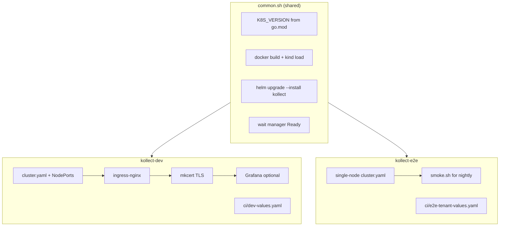

# Local kind clusters

Two lean [kind](https://kind.sigs.k8s.io/) profiles share install logic via
[`common.sh`](common.sh) (Kubernetes version pin, image build/load, Helm install, manager Ready
wait). Dev adds optional addons; e2e stays minimal for CI speed.



## Cluster comparison

| | **kollect-dev** | **kollect-e2e** |
| --- | --- | --- |
| **Purpose** | Daily local development | CI / nightly smoke |
| **Nodes** | 1 control-plane (ingress NodePorts 30080/30443) | 1 control-plane only |
| **Addons** | ingress-nginx, mkcert TLS, Grafana; optional Prometheus | None |
| **Helm values** | `charts/kollect/ci/dev-values.yaml` | `charts/kollect/ci/e2e-tenant-values.yaml` |
| **Skip addons** | `KOLLECT_DEV_MINIMAL=1 task kind-dev-up` | — |
| **Task targets** | `kind-dev-up`, `kind-dev-down`, `kind-dev-load`, `kind-dev-status` | `kind-e2e-up`, `kind-e2e-down` |

Both clusters pin the node image to the Kubernetes minor version derived from `go.mod`
(`k8s.io/api` → `kindest/node:v1.x.x`), keeping local dev, envtest, and CI aligned.

## Quick start

```sh
# Dev (full addons)
task kind-dev-up

# Dev (operator only — faster on laptops)
KOLLECT_DEV_MINIMAL=1 task kind-dev-up

# Rebuild image after code changes
task kind-dev-load

# Status
task kind-dev-status

# Teardown
task kind-dev-down
```

E2E profile (matches nightly workflow):

```sh
task kind-e2e-up
bash hack/kind/e2e/smoke.sh   # post-install checks (includes cert-manager Certificate CRD smoke)
task kind-e2e-down

# Or one-shot via Task (setup + smoke + teardown):
task test:e2e
```

## Prerequisites (dev)

| Tool | Required for |
| --- | --- |
| Docker (or nerdctl/podman) | kind |
| [kind](https://kind.sigs.k8s.io/) v0.27+ | both profiles |
| [helm](https://helm.sh/) | both profiles |
| [mkcert](https://github.com/FiloSottile/mkcert) | dev TLS only (skipped gracefully if missing) |

Generated mkcert material lives under `hack/kind/dev/certs/` (git-ignored).

Optional: `KOLLECT_DEV_PROMETHEUS=1` installs a single-replica Prometheus in `monitoring`.

## Layout

```
hack/kind/
├── common.sh           # shared version, cluster, helm, image helpers
├── README.md
├── dev/
│   ├── cluster.yaml    # ingress NodePort mappings
│   ├── setup.sh        # cluster + operator + addons
│   ├── teardown.sh
│   └── status.sh
└── e2e/
    ├── cluster.yaml    # minimal single node
    ├── setup.sh        # cluster + operator only
    ├── smoke.sh        # nightly post-install smoke
    └── teardown.sh
```
